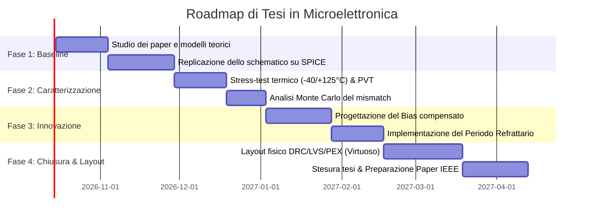

# Proposta di Tesi Sperimentale: Innovazioni Circuitali su Neuroni Spiking Analogici (LIF) in Subthreshold

**Ambito:** Microelettronica Analogica / Neuromorphic Computing / Ultra-Low-Power IC Design  
**Target Industriale:** R&D STMicroelectronics (Edge AI, ISPU, PMIC, Analog/Mixed-Signal Design)  
**Riferimenti di Partenza:**
* *Paper 1 (2026):* Salazar-Hernandez et al., *"Dual-Mode CMOS LIF Neuron With Subthreshold Efficiency and Saturation-Driven Robustness"*, IEEE Access.
* *Paper 2:* Besrour et al., *"Analog Spiking Neuron in 28 nm CMOS"*, IEEE Conference.

---

## 1. Executive Summary & Rationale

I circuiti *Leaky Integrate-and-Fire* (LIF) basati su conduzione in debole inversione (*subthreshold*) rappresentano lo stato dell'arte per l'inferenza di reti neurali a impulsi (SNN) a consumo ultraridotto (ordine dei femtojoule per spike).

Tuttavia, i design attualmente pubblicati in letteratura presentano **quattro colli di bottiglia fisici critici** che ne impediscono l'adozione affidabile in chip industriali di produzione:
1. **Instabilità termica estrema:** La corrente di sottosoglia cresce esponenzialmente con la temperatura, portando a derive di frequenza superiori al 200–300%.
2. **Assenza di periodo refrattario biologico regolabile:** Manca una protezione contro il sovraccarico e le scariche incontrollate a stimolo sostenuto.
3. **Vulnerabilità al mismatch di processo:** L'affidamento esclusivo a capacità parassite non compensate genera una forte dispersione statistica tra chip diversi (variabilità di Pelgrom).
4. **Alimentazione a corrente ideale:** I neuroni vengono eccitati con generatori ideali invece che con front-end sinaptici reali.

Questa proposta illustra **tre innovazioni circuitali concrete** implementabili a livello transistor, con l'obiettivo di trasformare una semplice tesi di simulazione in un lavoro scientificamente originale e di elevato valore industriale per STMicroelectronics.

---

## 2. Architettura Baseline (Analisi Critica dello Stato dell'Arte)

Nel circuito di partenza a 5 transistori (*Paper 1*):
* **M1 (NMOS in sottosoglia):** Integra la corrente di eccitazione $I_{ex}$ sul nodo di membrana $V_m$ e fornisce la conduttanza di leak intrinseca;
* **$C_m$:** Capacità di membrana formata unicamente da parassiti:
  $$C_m = C_{gd1} + C_{db1} + C_{gs2} + C_{gs3} + C_{gd2} + C_{gd3}$$
* **M2–M3 (Inverter CMOS):** Rilevatore di soglia (*trip point* $V_{th,lif}$);
* **M4–M5 (Inverter CMOS d'uscita):** Buffer di guadagno full-swing e anello di retroazione di reset che forza M1 in conduzione forte per scaricare $V_m$.

```
           VDD                 VDD                 VDD
            |                   |                   |
            +-------+           +-------+           +-------+
            |       |           |       |           |       |
            |     [M2] PMOS     |     [M4] PMOS     |       |
            |       |           |       |           |       |
I_ex ----> (Vm) ----+----->(Vmid)-------+----->(Vout)       |
            |       |           |       |           |       |
          [M1]    [M3] NMOS     |     [M5] NMOS     +-------+
          NMOS      |           |       |               |
       (Subthresh)  |           +-------+               |
            |       |                   |               |
            |      GND                 GND              |
            +<-----------------[ Feedback Reset ]-------+
```

---

## 3. Le Innovazioni Circuitali Proposte

### Innovazione 1: Compensazione Termica della Polarizzazione in Sottosoglia (Thermal Compensation)
> **Livello di Rilevanza:** ⭐⭐⭐⭐⭐ *(Il "colpo da maestro" per un colloquio in ST)*

#### Il Problema Fisico
In debole inversione ($V_{GS} < V_{th}$), la corrente di drain è governata dal trasporto per diffusione:
$$I_{D,sub}(T) = I_0 \left(\frac{T}{T_0}\right)^2 \exp\left( \frac{V_{GS} - V_{th}(T)}{n \, U_T(T)} \right) \left[ 1 - \exp\left(-\frac{V_{DS}}{U_T(T)}\right) \right]$$
dove:
* $U_T(T) = \frac{k T}{q}$ ha andamento **PTAT** (*Proportional to Absolute Temperature*);
* La tensione di soglia $V_{th}(T) = V_{th}(T_0) - \alpha (T - T_0)$ ha andamento **CTAT** (*Complementary to Absolute Temperature*), con $\alpha \approx 1.5 \div 2 \text{ mV/K}$.

All'aumentare della temperatura da $-20^\circ\text{C}$ a $+85^\circ\text{C}$, il termine esponenziale fa lievitare le correnti di dispersione, riducendo drasticamente l'impedenza equivalente del nodo di membrana. Il neurone o smette di integrare (la corrente di leak supera $I_{ex}$) oppure spara a frequenze fino a 5 volte superiori.

#### La Soluzione Circuitale: Bias Subthreshold CTAT-Compensato
Invece di assumere $I_{ex}$ costante, si progetta una cella di polarizzazione ausiliaria compatta (4 transistori) che modula la tensione di gate o la corrente di iniezione con un coefficiente di temperatura opposto a quello della sottosoglia.

```
       VDD
        |
      [Mb1] PMOS (specchio)
        +-----------------------------> Corrente I_bias(T) al neurone
        |                             
      [Mb2] NMOS (subthreshold)        
        |                             
      [R_tc / Mb3] Rete CTAT (compensa n*U_T)
        |
       GND
```

* **Risultato atteso:** Deriva della frequenza di firing $f_{spike}(T)$ contenuta entro il $\pm 15\%$ nell'intero range $-40^\circ\text{C} \div +125^\circ\text{C}$ (standard automotive/industriale ST), contro il $+250\%$ del circuito non compensato.

---

### Innovazione 2: Periodo Refrattario Biologico Programmabile & Spike-Frequency Adaptation (SFA)
> **Livello di Rilevanza:** ⭐⭐⭐⭐ *(Innovazione neuromorfica bio-ispirata pura)*

#### Il Problema Fisico
Nei circuiti di partenza, una volta avvenuto il reset, M1 torna istantaneamente nello stato di sottosoglia. In presenza di un forte stimolo continuo, il neurone spara ad anello aperto alla massima frequenza supportata dai ritardi di propagazione degli inverter.  
Biologicamente, questo non avviene: i neuroni corticali possiedono un **periodo refrattario assoluto e relativo** causato dalla cinetica lenta dei canali del potassio $K^+$, fondamentale per:
1. Limitare la dissipazione di potenza dinamica;
2. Prevenire instabilità e oscillazioni ad anello chiuso nella rete;
3. Introdurre la codifica dell'informazione tramite "Spike-Frequency Adaptation" (SFA).

#### La Soluzione Circuitale: Anello di Reset a Conduzione Rallentata (*Starved-Feedback Delay*)
Si modifica il path di feedback tra l'uscita $V_{out}$ e il gate di M1:
* Si inserisce un transistor di scarica (*starved NMOS*) con gate polarizzato da una tensione di controllo analogica $V_{refr}$;
* Si interpone un nodo a costante di tempo controllata che prolunga il periodo in cui M1 rimane parzialmente in conduzione, impedendo al nodo di membrana $V_m$ di ricominciare ad accumulare carica per un tempo prefissato $T_{refr}$.

```
                 +----------------- VDD
                 |
      Vout ----[M_inv] PMOS
                 |
                 +-----> Gate di M1 (Reset)
                 |
              [M_refr] NMOS (Gate collegato a V_ctrl_refr)
                 |
                GND
```

* **Vantaggio:** Con l'aggiunta di soli 1–2 transistor, si ottiene un periodo refrattario programmabile da $10 \text{ ns}$ a $10 \text{ \mu s}$ agendo su una singola linea di controllo, senza alterare il consumo a riposo.

---

### Innovazione 3: Compensazione del Mismatch di Processo tramite Bulk-Biasing (Body Effect Tuning)
> **Livello di Rilevanza:** ⭐⭐⭐⭐⭐ *(Altissimo valore per fonderia / microelettronica avanzata)*

#### Il Problema Fisico
Il *Paper 1* vanta l'assenza di condensatori fisici integrati (MIM o MOM), usando unicamente le capacità parassite $C_m$.  
Tuttavia, in produzione su silicio reale:
* Le capacità parassite variano del $\pm 25-35\%$ a causa delle tolleranze litografiche e dell'ossido;
* La legge di Pelgrom sul mismatch di soglia:
  $$\sigma_{\Delta V_{th}} = \frac{A_{V_{th}}}{\sqrt{W \cdot L}}$$
  rende la soglia di scatto dell'inverter M2–M3 altamente dispersa da die a die. In un array di 1000 neuroni, ogni neurone sparerebbe a una frequenza arbitraria.

#### La Soluzione Circuitale: Taratura Dinamica tramite Body Biasing ($V_{bulk}$)
Nelle tecnologie CMOS moderne (in particolare FD-SOI a 28nm di ST o Bulk con triple-well):
* Il terminale di Bulk (substrato/well) di M2 o M3 può essere disaccoppiato da VDD/GND e pilotato con una tensione di correzione $V_{body}$;
* Tramite l'effetto body:
  $$V_{th} = V_{th0} + \gamma \left( \sqrt{2\phi_F + V_{SB}} - \sqrt{2\phi_F} \right)$$
  è possibile **calibrare la soglia di firing del neurone** in fase di post-fabbricazione, compensando interamente il mismatch di processo senza dover inserire banchi di condensatori digitali ingombranti.

---

### Innovazione 4: Cella Sinaptica Integrata (Front-End Neuromorfico Completo)
> **Livello di Rilevanza:** ⭐⭐⭐⭐ *(Estensione a livello di sistema)*

Invece di utilizzare un generatore ideale di corrente $I_{ex}$, si progetta una cella sinaptica a 2 transistori (transistor di peso + switch attivato dal pre-spike) che inietta una carica discretizzata $Q_{syn} = C_{syn} \cdot \Delta V$ sul nodo $V_m$.  
Questo dimostra il funzionamento di un'unità completa **Sinapsi + Neurone**, elemento base di qualsiasi acceleratore hardware neuromorfico.

---

## 4. Matrice di Confronto: Stato dell'Arte vs Circuito Proposto

La seguente tabella rappresenta la base per la **Comparison Table** della tesi e dell'eventuale paper IEEE:

| Parametro / Metrica | Paper 1 (IEEE Access 2026) | Paper 2 (28 nm CMOS) | **Architettura Proposta (Tesi)** |
| :--- | :--- | :--- | :--- |
| **Tecnologia di riferimento** | 130 nm CMOS (SkyWater) | 28 nm CMOS (TSMC) | 130 nm / 28 nm (PDK del lab) |
| **Numero di Transistori** | 5 | 8 | **7 – 9** (incluso bias e refrattarietà) |
| **Condensatori integrati espliciti** | 0 (solo parassite) | 2 | **0 (oppure 1 sub-pF)** |
| **Consumo energetico per spike** | $\approx 4.2 \text{ fJ/spike}$ | $1.2 \text{ fJ/spike}$ | **$\approx 1.5 \div 3 \text{ fJ/spike}$** |
| **Stabilità Termica ($-40 \div +125^\circ\text{C}$)** | Non quantificata (instabile) | Non quantificata | **Compensata con Subthreshold Bias** |
| **Periodo Refrattario** | Non implementato | Fisso tramite $C_{res}$ | **Programmabile analogicamente** |
| **Resilienza al Mismatch (Pelgrom)**| Bassa ($\sigma_f$ elevato) | Media | **Alta (grazie a Body-Biasing / Tuning)** |
| **Validazione Industriale** | Simulazione tipica | Post-layout | **Corner PVT + Monte Carlo (200 run)** |

---

## 5. Piano Operativo di Sviluppo (Roadmap Temporale)



### Dettaglio delle Fasi:
1. **Mese 1 – Setup & Replicazione:**
   * Importazione dei parametri PDK su Cadence Virtuoso o Xschem/Ngspice.
   * Replicazione delle curve $f_{spike}$ vs $I_{ex}$ del Paper 1 e Paper 2 a condizioni nominali ($27^\circ\text{C}$, TT).
2. **Mese 2 – Evidenziazione dei Limiti:**
   * Simulazione nei 4 corner di processo (FF, SS, FS, SF) e sweep termico da $-40^\circ\text{C}$ a $+125^\circ\text{C}$.
   * Identificazione del punto esatto di degrado della frequenza e saturazione.
3. **Mese 3 – Implementazione dell'Innovazione:**
   * Dimensionamento della cella di polarizzazione CTAT e validazione del bilanciamento termico.
   * Inserimento del transistor di refrattarietà e tracciamento delle curve a corrente elevata.
4. **Mese 4 – Simulazione Statistica & Layout:**
   * Esecuzione di 200–500 iterazioni Monte Carlo per verificare la dispersione gaussiana di frequenza e consumo.
   * Realizzazione del layout fisico, calcolo dell'area occupata in $\mu m^2$ e comparazione pre-layout vs post-layout (PEX).
5. **Mese 5 – Redazione Tesi & Paper IEEE:**
   * Redazione capitoli di tesi.
   * Impaginazione dei risultati su template IEEE (4 pagine) per sottomissione a conferenza internazionale.

---

## 6. Perché questo piano è perfetto per STMicroelectronics

Presentarsi al colloquio per posizioni di **Analog / Mixed-Signal IC Designer** con questo progetto dimostra:
* **Competenza a livello transistor:** Comprensione profonda della fisica in debole inversione, non limitata all'uso di amplificatori operazionali standard;
* **Cultura del silicio reale:** Aver affrontato e risolto le non-idealità che le aziende affrontano ogni giorno (temperatura, dispersioni di fabbricazione, parassite di layout);
* **Padronanza del flusso industriale:** Familiarità con strumenti EDA standard (Cadence Virtuoso, Spectre, Assura/Calibre per DRC/LVS) e metodologie di verifica PVT/Monte Carlo.
